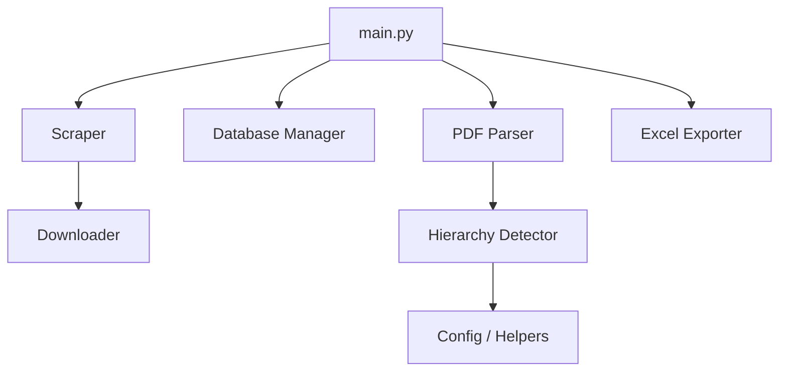

# CMF Financial Data Extractor

A modular Python tool for extracting structured financial data (Passif, Actif, etc.) from PDF documents on the CMF (Conseil du Marché Financier) website.

## 🏗 Project Structure

The project is organized into modular components to ensure maintainability and scalability.

### 📍 Core Components

- **`main.py`**: The central entry point. Orchestrates the interactive CLI, handles user selections, and manages the end-to-end workflow.

### 🌐 Scraper Module (`src/scraper/`)
- **`cmf_scraper.py`**:
  - `init_driver()`: Initializes the Chrome Selenium driver.
  - `get_all_companies(driver)`: Fetches the list of all available companies from the CMF portal.
  - `select_company_and_submit(driver, target_societe)`: Automates the selection and form submission for a specific company.
  - `scrape_document_list(driver, target_societe)`: Extracts metadata (URL, name, year) for all available documents.
- **`pdf_downloader.py`**:
  - `download_pdf(url, societe, nom, annee)`: Downloads the PDF file and saves it locally with a standardized naming convention.

### 📄 Extraction Module (`src/extraction/`)
- **`pdf_parser.py`**:
  - `search_table_in_pdf(pdf_path, table_type)`: Scans the PDF to find the specific page containing the requested table (e.g., PASSIF).
  - `extract_passif(...)`, `extract_actif(...)`: Specialized functions that handle the specific extraction logic for each table type.
  - `extract_table_from_page(...)`: Uses a hybrid approach (Camelot for native PDFs, Tesseract OCR for scanned documents) to extract raw rows.
- **`hierarchy_detector.py`**:
  - `detect_hierarchy_level(...)`: Analyzes lines to identify codes (CP, PA), levels (Title, Section, Category, Sub-category), and descriptions.
  - `structure_hierarchical_data(...)`: Transforms raw list of rows into a structured object with metadata and multiple columns of numeric values.
- **`excel_exporter.py`**:
  - `export_to_excel(...)`: Generates a professional Excel file with themed styling, proper indentation based on hierarchy, and specific columns (Type, Code, Description, etc.).

### 🗄 Database Module (`src/database/`)
- **`db_manager.py`**:
  - `create_database_and_tables()`: Sets up the SQL Server database (ODBC) and tables for documents and financial data.
  - `insert_document(...)`: Logs document metadata to avoid duplicates.
  - `insert_financial_data(...)`: Persists the structured extraction results for later analysis.

### 🛠 Utils & Config
- **`src/utils/helpers.py`**: Contains utility functions for data cleaning and number parsing.
- **`config/document_structure.py`**: Centralizes the business logic for CP/PA code mappings and hierarchical relationships.

## 🔄 Component Communication

1. **Discovery**: `main.py` uses the **Scraper** to find the requested document on the CMF website.
2. **Persistence**: Metadata is stored via the **Database Manager**.
3. **Extraction**: The **PDF Parser** identifies the correct page and extracts raw data using **Camelot** or **OCR**.
4. **Structuring**: The **Hierarchy Detector** applies business rules from the **Config** to organize the raw data into a logical structure.
5. **Output**: The **Excel Exporter** produces the final validation file for the user.

---
*Note: Legacy scripts (`A.py`, `B.py`, `CapitauxPassifs.py`) are kept in the root for reference but are not part of the core modular workflow.*
